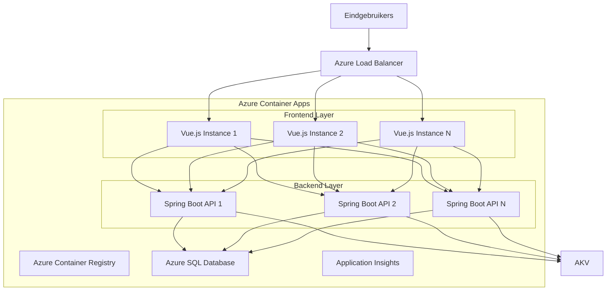
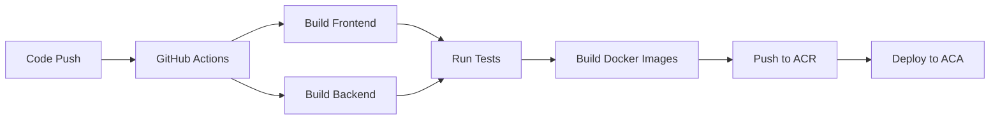
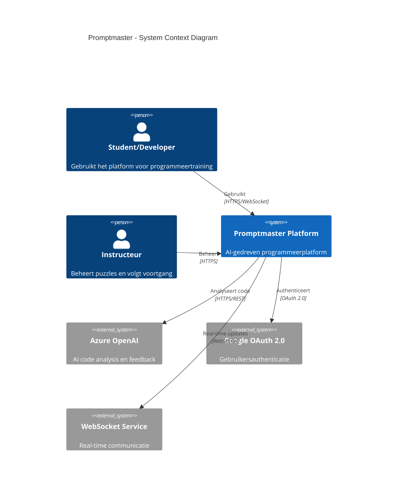
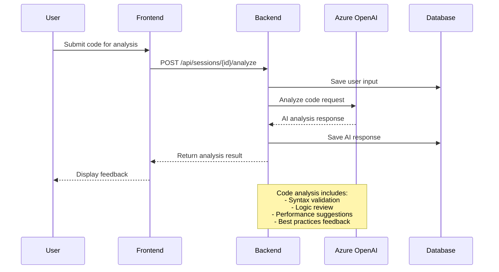
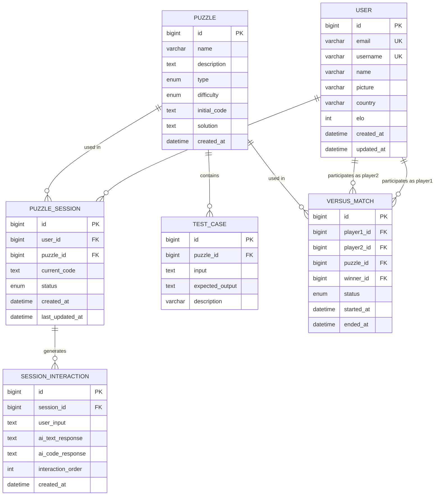
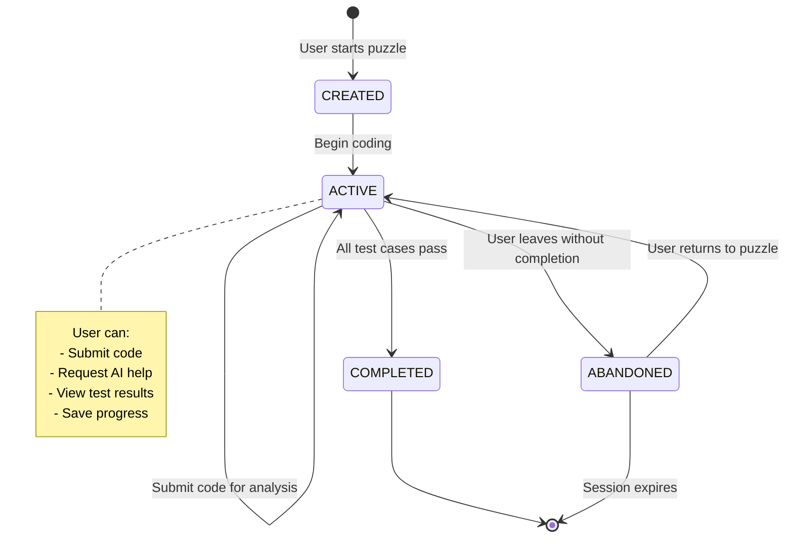
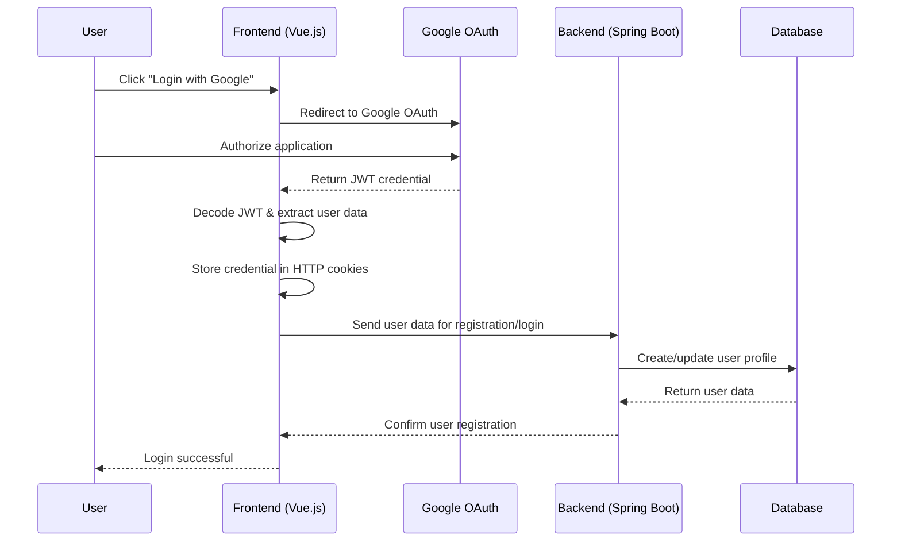
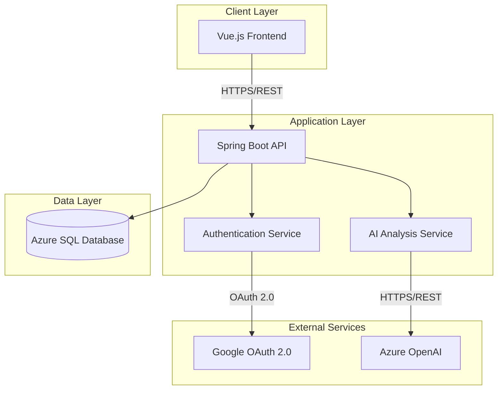

# Technische Documentatie Promptmaster

## Samenvatting van de opdracht

In het huidige technologische landschap wordt het vermogen om te programmeren steeds crucialer, maar traditionele programmeeropleidingen schieten vaak tekort in het bieden van effectieve leertrajecten. De kernproblemen zijn divers en complex: studenten krijgen onvoldoende directe feedback op hun code, er is een gebrek aan praktische oefening in realistische scenario's, en de één-op-veel benadering van klassikaal onderwijs maakt het onmogelijk om het tempo en niveau aan te passen aan individuele leerbehoeften. Dit resulteert in hoge uitvalpercentages, een groeiende kloof tussen theoretische kennis en praktische vaardigheden, en afgestudeerden die onvoldoende voorbereid zijn op de realiteit van professionele softwareontwikkeling. Daarnaast worstelen onderwijsinstellingen met de snelle evolutie van programmeertalen en frameworks, waardoor curricula vaak achterlopen op de actuele behoeften van de arbeidsmarkt.

Als antwoord op deze uitdagingen is Promptmaster ontwikkeld: een innovatief, AI-aangedreven codeerplatform dat de traditionele beperkingen van programmeeronderwijs doorbreekt. Het platform integreert geavanceerde kunstmatige intelligentie voor real-time code-analyse en persoonlijke feedback, met een gamification-systeem dat motivatie en betrokkenheid stimuleert door middel van competitieve elementen zoals versus matches en een ELO-ratingsysteem. De combinatie van adaptieve leerpaden, directe feedback, en praktijkgerichte uitdagingen zorgt voor een gepersonaliseerde leerervaring die zich automatisch aanpast aan het niveau en de voortgang van elke gebruiker. Door de implementatie van moderne cloud-technologie en een microservices-architectuur is het platform schaalbaar en toegankelijk voor een wereldwijd publiek, terwijl de integratie met industriestandaarden en best practices zorgt voor een directe aansluiting op de professionele praktijk. Deze innovatieve aanpak democratiseert hoogwaardig programmeeronderwijs en bereidt de volgende generatie ontwikkelaars effectief voor op de uitdagingen van moderne softwareontwikkeling.

### Probleemstelling
Traditionele programmeeropleidingen worden geconfronteerd met verschillende uitdagingen:
- Beperkte mogelijkheden voor directe, persoonlijke feedback
- Gebrek aan motivatie en betrokkenheid bij studenten
- Moeilijkheid in het aanpassen aan verschillende leerniveaus
- Beperkte mogelijkheden voor praktische oefening
- Weinig integratie met moderne ontwikkelpraktijken

Deze problemen leiden vaak tot:
1. Hoge uitvalpercentages in programmeeropleidingen
2. Een kloof tussen theoretische kennis en praktische vaardigheden
3. Verminderde motivatie bij studenten
4. Inefficiënt leerproces
5. Beperkte voorbereiding op professionele ontwikkelomgevingen

### Oplossing en Innovatie
Promptmaster adresseert deze uitdagingen door middel van een innovatief platform dat verschillende kernelementen combineert:

#### 1. AI-Gestuurde Code Analyse en Feedback
- **Real-time Code Evaluatie**
  - Syntaxcontrole en stijlanalyse tijdens het typen
  - Identificatie van potentiële bugs en inefficiënties
  - Suggesties voor optimalisatie en verbetering
  - Contextbewuste hints en voorbeelden

- **Persoonlijke Leerondersteuning**
  - Analyse van programmeerpatronen en gewoonten
  - Identificatie van kennishiaten en leerbehoeften
  - Adaptieve moeilijkheidsgraad op basis van prestaties
  - Gepersonaliseerde leeraanbevelingen

- **Automatische Testvalidatie**
  - Uitgebreide test suites voor elke uitdaging
  - Immediate feedback op correctheid
  - Performance analyse van oplossingen
  - Vergelijking met best practices

#### 2. Competitief en Collaboratief Leren
- **Versus Mode**
  - Real-time programmeerduels
  - Skill-based matchmaking via ELO-systeem
  - Verschillende game modes (tijdrace, accuraatheid, optimalisatie)
  - Live code-sharing en interactie

- **Community Features**
  - Globale en regionale leaderboards
  - Peer review systeem
  - Code sharing en discussieplatform
  - Team-based challenges en competities

- **Achievements en Progressie**
  - Uitgebreid badge-systeem
  - Skill-based rankings
  - Dagelijkse en wekelijkse uitdagingen
  - Persoonlijke en teamstatistieken

#### 3. Adaptief Curriculum en Leerpad
- **Gepersonaliseerde Leertrajecten**
  - Dynamische aanpassing van moeilijkheidsgraad
  - Focus op individuele leerdoelen
  - Progressieve skill ontwikkeling
  - Multitrack leerroutes (web, mobile, AI, etc.)

- **Praktijkgerichte Challenges**
  - Real-world programmeerscenario's
  - Industry-standard best practices
  - Modern tooling en workflows
  - Collaborative projecten

- **Skill Assessment en Certificering**
  - Gedetailleerde voortgangsmonitoring
  - Competentie-based evaluatie
  - Officiële certificeringen
  - Portfolio ontwikkeling

### Technologische Excellentie
Promptmaster onderscheidt zich door:

#### Geavanceerde Technische Implementatie
- State-of-the-art AI-modellen voor code-analyse
- Microservices architectuur voor optimale schaalbaarheid
- Real-time collaboratie engine
- Cloud-native infrastructuur

#### Gebruikerservaring
- Intuïtieve, moderne interface
- Responsive design voor alle devices
- Snelle, native-like performance
- Toegankelijkheid volgens WCAG 2.1 richtlijnen

#### Security en Privacy
- End-to-end encryptie
- GDPR-compliant dataverwerking
- Secure code execution environment
- Uitgebreide privacy controls

### Maatschappelijke Impact
Het platform draagt bij aan verschillende maatschappelijke doelen:

#### Democratisering van Programmeeronderwijs
- Toegankelijk voor alle skill levels
- Gratis basisfunctionaliteit
- Ondersteuning voor meerdere talen
- Focus op inclusiviteit

#### Arbeidsmarkt Ontwikkeling
- Aansluiting op industriestandaarden
- Voorbereiding op professionele ontwikkeling
- Certificering en validatie van skills
- Netwerkmogelijkheden met werkgevers

#### Innovatie in Onderwijs
- Nieuwe onderwijsmethodieken
- Data-driven learning analytics
- Integratie met bestaande onderwijssystemen
- Continue innovatie en verbetering

### Toekomstperspectief
Promptmaster is ontworpen met het oog op continue groei en ontwikkeling:

#### Korte Termijn (1-2 jaar)
- Uitbreiding van de programmeertalen bibliotheek
- Implementatie van AI-gedreven code reviews
- Introductie van team-based learning features
- Integratie met populaire IDE's

#### Middellange Termijn (2-3 jaar)
- Ontwikkeling van enterprise oplossingen
- Uitbreiding naar mobile development
- Implementatie van VR/AR leerervaringen
- Internationale lokalisatie en expansie

#### Lange Termijn (3-5 jaar)
- Ontwikkeling van een volledig AI-gedreven tutoring systeem
- Creatie van een globaal certificeringssysteem
- Integratie met formele onderwijsprogramma's
- Ontwikkeling van gespecialiseerde industriemodules

### Conclusie
Promptmaster vertegenwoordigt een significante stap voorwaarts in programmeeronderwijs door het combineren van AI-technologie, gamification en moderne onderwijsprincipes. Het platform biedt een schaalbare, effectieve oplossing voor de groeiende behoefte aan kwalitatief programmeeronderwijs en draagt bij aan de ontwikkeling van de volgende generatie softwareontwikkelaars.

## Impact op de infrastructuur

Promptmaster is ontworpen als een volledig cloud-native platform dat gebruik maakt van moderne infrastructuurprincipes. De impact op de huidige infrastructuur is minimaal omdat het platform geen fysieke servers vereist en volledig draait op Azure Cloud Services. Deze keuze biedt significante voordelen op het gebied van schaalbaarheid, onderhoudbaarheid en kostenefficiëntie.

### Infrastructuuroverzicht

#### Hardware en Systeemvereisten
Het platform hanteert een cloudgebaseerde aanpak die de traditionele infrastructuuruitdagingen elimineert:

**Hosting en Connectiviteit:**
- Geen fysieke servers of datacenters vereist
- Volledig gehoste oplossing via Microsoft Azure
- Minimale bandbreedte: 100 Mbps dedicated verbinding
- Aanbevolen: redundante internetconnectie voor maximale beschikbaarheid

**Azure Cloud Platform Selectie:**
De keuze voor Azure is gebaseerd op strategische overwegingen die direct bijdragen aan de platformdoelstellingen:
- **Elastische schaalbaarheid** - automatische aanpassing aan gebruikersvolume
- **Geïntegreerde DevOps** - naadloze CI/CD pipeline implementatie  
- **Geavanceerde monitoring** - real-time performance en health tracking
- **Flexibel kostenmodel** - pay-per-use zonder upfront investeringen

#### Architectuurdiagram



### Schaalbaarheid en Performance

#### Automatische Schaling
Het platform implementeert intelligente auto-scaling mechanismen die real-time reageren op gebruikersvraag:

| **Scaling Trigger** | **Drempelwaarde** | **Actie** |
|-------------------|-----------------|---------|
| CPU Gebruik | > 70% | Nieuwe instance toevoegen |
| Memory Gebruik | > 80% | Horizontale uitbreiding |
| Request Queue | > 100 requests | Load balancing optimalisatie |

**Instance Management:**
- **Minimum configuratie:** 3 actieve instances voor redundantie
- **Maximum capaciteit:** 20 instances tijdens piekbelasting
- **Scaling tijd:** < 2 minuten voor nieuwe instance deployment

#### Database Strategie
De datalagarchitectuur is ontworpen voor optimale performance en beschikbaarheid:

**Azure SQL Elastic Pool Implementatie:**
- Automatische storage uitbreiding naar behoefte
- Read replica's voor geografische distributie
- Intelligent query optimization met AI-ondersteuning
- Automated backup met point-in-time recovery

### Technologie Stack en Licenties

#### Frontend Componenten
| **Technologie** | **Versie** | **Licentie** | **Gebruik** |
|----------------|-----------|-------------|------------|
| Vue.js | 3.x | MIT | Core framework |
| Vite | Latest | MIT | Build tooling |
| UnoCSS | Latest | MIT | Styling system |
| TypeScript | 5.x | Apache 2.0 | Type safety |

#### Backend Infrastructuur
| **Component** | **Versie** | **Licentie** | **Functie** |
|--------------|-----------|-------------|------------|
| Spring Boot | 3.x | Apache 2.0 | API framework |
| Java OpenJDK | 17 LTS | GPL v2 + CE | Runtime environment |
| Maven | 3.x | Apache 2.0 | Dependency management |

#### Cloud Services (Pay-per-Use Model)
- **Azure Container Apps** - Serverless container hosting
- **Azure SQL Database** - Managed database service  
- **Azure Container Registry** - Private image repository
- **Azure Application Insights** - Performance monitoring en analytics

### Kosten en Resource Optimalisatie

Het cloud-native model biedt significante kostenvoordelen door het elimineren van:
- Upfront hardware investeringen
- Datacenter onderhoud en management
- Licentiekosten voor on-premise software
- Dedicated IT infrastructuur personeel

De pay-as-you-scale benadering zorgt ervoor dat kosten direct correleren met platformgebruik en business value, wat resulteert in een optimale ROI en financiële voorspelbaarheid.

## Release plan

Het release plan voor Promptmaster is ontworpen om een robuuste, betrouwbare en geautomatiseerde deployment pipeline te bieden. Het platform maakt gebruik van moderne DevOps-principes en Azure cloud services om een naadloze gebruikerservaring te garanderen. De deployment strategie omvat geautomatiseerde testing, container orchestratie, en zero-downtime deployments via Azure Container Apps.

### Deployment Architectuur en Proces

De Promptmaster deployment volgt een gestructureerde aanpak die bestaat uit meerdere fasen, elk met specifieke validatie- en verificatiestappen. De keuze voor Azure Container Apps als hostingplatform biedt significante voordelen op het gebied van schaalbaarheid, beheer en kostenoptimalisatie.

#### Build Pipeline Overzicht



Het deployment proces begint wanneer ontwikkelaars code pushen naar de main branch van de GitHub repository. Dit triggert automatisch een GitHub Actions workflow die alle stappen uitvoert van het bouwen van de applicatie tot het deployen naar de productieomgeving. De pipeline is ontworpen met fail-fast principes, waarbij elke stap moet slagen voordat de volgende kan beginnen.

### Gedetailleerd Installatie Stappenplan

#### Fase 1: Azure Infrastructure Provisioning

De eerste fase van de deployment omvat het opzetten van de benodigde Azure resources. Deze stap wordt normaal gesproken eenmalig uitgevoerd tijdens de initiële setup van het project, maar kan ook worden gebruikt voor disaster recovery of het opzetten van nieuwe omgevingen.

**Resource Group en Basisconfiguratie:**
```bash
# Resource Group aanmaken voor alle Promptmaster resources
az group create --name promptmaster-rg --location westeurope

# Container Registry voor het opslaan van Docker images
az acr create --name promptmasteracr --resource-group promptmaster-rg --sku Basic

# SQL Database Server voor data persistentie
az sql server create --name promptmaster-sql --resource-group promptmaster-rg
```

Deze Azure resources vormen de ruggengraat van de Promptmaster infrastructuur. De Container Registry slaat alle applicatie images op, de SQL Database beheert alle persistente data en configuratie.

#### Fase 2: Database Setup en Migratie

**Database Initialisatie en Schema Setup:**
```bash
# Database instance aanmaken binnen de SQL Server
az sql db create --name promptmaster-db --server promptmaster-sql

# Uitvoeren van database schema migraties
./scripts/migrate-database.sh

# Laden van initiële data en configuratie
./scripts/seed-database.sh
```

De database setup omvat het aanmaken van alle benodigde tabellen, indexen, en stored procedures. Het migratiescript zorgt ervoor dat de database schema consistent is met de applicatie requirements. De seed data bevat essentiële informatie zoals standaard puzzle configuraties en initiële gebruikersrollen.

#### Fase 3: Container Apps Deployment

**Frontend en Backend Container Deployment:**
```bash
# Frontend Vue.js applicatie deployment
az containerapp create --name frontend \
  --resource-group promptmaster-rg \
  --image promptmasteracr.azurecr.io/frontend:latest \
  --target-port 8081 \
  --ingress external

# Backend Spring Boot API deployment  
az containerapp create --name backend \
  --resource-group promptmaster-rg \
  --image promptmasteracr.azurecr.io/backend:latest \
  --target-port 8080 \
  --ingress external
```

De container deployment fase zorgt voor het daadwerkelijk draaien van de applicaties. Elke container wordt geconfigureerd met de juiste poorten, ingress settings, en resource allocatie. Azure Container Apps beheert automatisch load balancing, health checks, en auto-scaling.

### CI/CD Pipeline Implementatie

#### Geautomatiseerde Workflow Stappen

De CI/CD pipeline is het hart van het deployment proces en omvat de volgende kritieke stappen:

**1. Code Validatie en Kwaliteitscontrole**
- **Linting en formatting**: Automatische controle van code style en conventions
- **Static code analysis**: Identificatie van potentiële bugs en security issues
- **Dependency scanning**: Controle op bekende vulnerabilities in third-party libraries

**2. Geautomatiseerde Testing Suite**
- **Unit tests**: Individuele component testing met coverage rapportage
- **Integration tests**: API endpoint testing en database interaction validatie
- **End-to-end tests**: Complete user journey testing via Playwright

**3. Container Building en Security**
- **Multi-stage Docker builds**: Optimized container images met minimale attack surface
- **Security scanning**: Vulnerability assessment van container images
- **Image optimization**: Layer caching en size reduction voor snellere deployments

**4. Deployment en Verificatie**
- **Staging deployment**: Automatische deployment naar test environment
- **Health checks**: Verificatie van applicatie status en performance
- **Production deployment**: Zero-downtime deployment naar productie
- **Post-deployment monitoring**: Automatische monitoring van key metrics

### Environment Variables Configuratie via Azure Portal

#### Kritieke Configuratie in Container Apps

Een essentieel onderdeel van de deployment is het correct configureren van environment variables via de Azure Portal. Deze configuratie is noodzakelijk voor het functioneren van de applicatie en moet zorgvuldig worden uitgevoerd na elke deployment.

**Toegang tot Environment Variables:**

1. **Navigatie in Azure Portal:**
   - Open de Azure Portal (portal.azure.com)
   - Ga naar Resource Groups → promptmaster-rg
   - Selecteer de Container App (frontend of backend)
   - Klik op "Configuration" in het linker menu

2. **Environment Variables Instellen:**
   - Klik op de "Environment variables" tab
   - Gebruik "Add" om nieuwe variabelen toe te voegen
   - Configureer zowel "Name" als "Value" voor elke variabele

**Vereiste Backend Environment Variables:**

| **Variabele Naam** | **Beschrijving** | **Voorbeeld Waarde** |
|-------------------|------------------|---------------------|
| `SPRING_PROFILES_ACTIVE` | Active Spring profile | `prod` |
| `SPRING_DATASOURCE_URL` | Database connection string | `jdbc:sqlserver://promptmaster-sql.database.windows.net:1433;database=promptmaster-db` |
| `SPRING_DATASOURCE_USERNAME` | Database gebruikersnaam | `promptmaster_user` |
| `SPRING_DATASOURCE_PASSWORD` | Database wachtwoord | `***` (hardcoded in configuratie) |
| `AZURE_OPENAI_ENDPOINT` | Azure OpenAI service endpoint | `https://promptmaster-openai.openai.azure.com/` |
| `AZURE_OPENAI_API_KEY` | OpenAI API authenticatie sleutel | `***` (hardcoded in configuratie) |
| `AZURE_OPENAI_DEPLOYMENT_NAME` | OpenAI model deployment naam | `gpt-4` |
| `APP_CORS_ALLOWED_ORIGINS` | Toegestane CORS origins | `https://promptmaster-frontend.azurecontainerapps.io` |

**Vereiste Frontend Environment Variables:**

| **Variabele Naam** | **Beschrijving** | **Voorbeeld Waarde** |
|-------------------|------------------|---------------------|
| `VITE_API_BASE_URL` | Backend API base URL | `https://promptmaster-backend.azurecontainerapps.io` |
| `VITE_WS_URL` | WebSocket connection URL | `wss://promptmaster-backend.azurecontainerapps.io/ws` |
| `VITE_ENVIRONMENT` | Application environment | `production` |

**Belangrijke Opmerkingen bij Environment Variables:**

- **Security**: Gebruik nooit plain text voor gevoelige informatie zoals wachtwoorden of API keys
- **Hardcoded Configuration**: API keys en wachtwoorden zijn momenteel hardcoded in configuratiebestanden
- **Restart Requirement**: Na het wijzigen van environment variables moet de Container App worden herstart
- **Validation**: Test altijd de applicatie na het wijzigen van configuratie om te zorgen dat alles correct werkt

#### Configuratie Management en Best Practices

**Development vs Production Environment:**

De applicatie ondersteunt verschillende configuratie sets voor verschillende omgevingen. Dit zorgt voor flexibiliteit tijdens ontwikkeling en stabiliteit in productie.

**Development Configuratie:**
- Lokale database connecties voor snelle ontwikkeling
- Debug logging enabled voor gedetailleerde troubleshooting
- Hot reloading en development tools geactiveerd
- Relaxed security settings voor gemakkelijker testen

**Production Configuratie:**
- Geoptimaliseerde database connection pooling
- Minimale logging voor performance en security
- Strikte CORS en security headers
- Gecomprimeerde assets en optimized caching

**Environment Variable Management:**
- Hardcoded configuratie in application.properties en application-prod.yml bestanden
- Gestructureerde naming conventions voor consistentie
Deze uitgebreide configuratie zorgt ervoor dat de Promptmaster applicatie veilig, performant en betrouwbaar draait in de Azure cloud omgeving.

## Technisch design

Het technisch design van Promptmaster volgt moderne software architectuurprincipes en best practices voor cloud-native applicaties. De architectuur is ontworpen voor schaalbaarheid, onderhoudbaarheid en performance, met een sterke focus op gebruikerservaring en betrouwbaarheid.

### Software Architectuur

#### Microservices Architectuur Overzicht

Promptmaster implementeert een microservices architectuur die optimaal gebruik maakt van Azure cloud services. Deze aanpak biedt voordelen op het gebied van schaalbaarheid, fault tolerance en ontwikkelingsflexibiliteit.



#### Component Architectuur

De applicatie bestaat uit verschillende logische lagen die elk een specifieke verantwoordelijkheid hebben:

**Frontend Layer (Vue.js 3):**
- **Presentation Components**: UI components voor gebruikersinteractie
- **State Management**: Centralized state via Pinia stores
- **Routing**: Client-side navigation met Vue Router
- **WebSocket Client**: Real-time communicatie voor versus mode

**Backend Layer (Spring Boot):**
- **Controller Layer**: REST API endpoints en request handling
- **Service Layer**: Business logic en application services
- **Repository Layer**: Data access en persistence
- **Security Layer**: Authentication en authorization

**Data Layer:**
- **Azure SQL Database**: Relationele data opslag
- **Application Configuration**: Hardcoded configuratie in properties bestanden

#### Klassendiagram - Core Domain Model

```mermaid
classDiagram
    class User {
        +Long id
        +String email
        +String username
        +String name
        +String picture
        +String country
        +Integer elo
        +LocalDateTime createdAt
        +LocalDateTime updatedAt
        +List~PuzzleSession~ sessions
        +List~SessionInteraction~ interactions
    }
    
    class Puzzle {
        +Long id
        +String name
        +String description
        +PuzzleType type
        +Difficulty difficulty
        +String initialCode
        +String solution
        +List~TestCase~ testCases
        +LocalDateTime createdAt
    }
    
    class PuzzleSession {
        +Long id
        +User user
        +Puzzle puzzle
        +String currentCode
        +SessionStatus status
        +LocalDateTime createdAt
        +LocalDateTime lastUpdatedAt
        +List~SessionInteraction~ interactions
    }
    
    class SessionInteraction {
        +Long id
        +PuzzleSession session
        +String userInput
        +String aiTextResponse
        +String aiCodeResponse
        +Integer interactionOrder
        +LocalDateTime createdAt
    }
    
    class TestCase {
        +Long id
        +Puzzle puzzle
        +String input
        +String expectedOutput
        +String description
    }
    
    User ||--o{ PuzzleSession : "heeft"
    Puzzle ||--o{ PuzzleSession : "gebruikt in"
    Puzzle ||--o{ TestCase : "bevat"
    PuzzleSession ||--o{ SessionInteraction : "genereert"
    
    <<enumeration>> PuzzleType
    PuzzleType : BYPASS
    PuzzleType : FAULTY
    PuzzleType : MULTI_STEP
    
    <<enumeration>> Difficulty
    Difficulty : BEGINNER
    Difficulty : INTERMEDIATE
    Difficulty : ADVANCED
    
    <<enumeration>> SessionStatus
    SessionStatus : ACTIVE
    SessionStatus : COMPLETED
    SessionStatus : ABANDONED
```

#### Sequence Diagram - AI Code Analysis Proces



### Database Architectuur

#### Conceptuele Database Structuur

De database architectuur is ontworpen voor optimale performance en data integriteit. De structuur ondersteunt de core functionaliteiten van het platform terwijl schaalbaarheid wordt gewaarborgd.

**Entity Relationship Diagram:**



**Database Optimalisatie Strategieën:**

| **Aspect** | **Implementatie** | **Voordeel** |
|------------|------------------|-------------|
| **Indexing** | Composite indexes op user_id + created_at | Snelle query performance voor user sessions |
| **Partitioning** | Date-based partitioning voor SESSION_INTERACTION | Verbeterde query performance op grote datasets |
| **Connection Pooling** | HikariCP met optimale pool configuratie | Efficient database connection management |

### Toestandsdiagram - Puzzle Session Lifecycle



## Externe systeeminterfaces

Promptmaster integreert met verschillende externe systemen om een rijke gebruikerservaring te bieden. Deze integraties zijn ontworpen met focus op betrouwbaarheid, security en performance.

### API Integraties en Communicatieprotocollen

#### Azure OpenAI Service Integratie

De Azure OpenAI integratie vormt het hart van Promptmaster's AI-gedreven code-analyse functionaliteit. Het platform maakt gebruik van de GPT-4 model via Azure's cloud service om intelligente feedback te bieden op gebruikerscode. 

**Integratie Overzicht:**
De integratie is geïmplementeerd als een dedicated service component binnen de Spring Boot backend die verantwoordelijk is voor alle AI-gerelateerde operaties. Deze service communiceert met Azure OpenAI via een RESTful API using HTTPS protocol en gebruikt een hardcoded API key voor authenticatie die is geconfigureerd in de application properties.

**Functionaliteiten:**
- **Real-time Code Analyse**: Gebruikerscode wordt geanalyseerd op syntaxis, logica en best practices
- **Contextbewuste Feedback**: Het AI-systeem ontvangt puzzelcontext om relevante en educatieve feedback te genereren
- **Gestructureerde Response**: Feedback wordt geretourneerd in een gestructureerd formaat dat direct kan worden geïntegreerd in de gebruikersinterface

**Technische Implementatie:**
Het systeem gebruikt een temperatuur setting van 0.3 om consistente en betrouwbare responses te garanderen, met een maximum token limiet van 1000 voor geoptimaliseerde performance. Alle communicatie verloopt via veilige HTTPS verbindingen waarbij de API key wordt gebruikt voor authenticatie.

#### Google OAuth 2.0 Integration

De Google OAuth 2.0 integratie biedt een veilige en gebruiksvriendelijke authenticatie-ervaring waarbij gebruikers zich kunnen aanmelden met hun bestaande Google-account. Dit elimineert de noodzaak voor het platform om eigen wachtwoordbeheer te implementeren.

**Authenticatie Flow:**
Het volgende sequence diagram illustreert de complete authenticatie flow van gebruikersinteractie tot succesvolle inlog:



**Flow Uitleg:**
De authenticatie begint wanneer een gebruiker op "Login with Google" klikt in de frontend. De gebruiker wordt vervolgens doorverwezen naar Google's OAuth service waar ze hun Google-account credentials invoeren en toestemming geven aan de Promptmaster applicatie om toegang te krijgen tot hun profiel en email informatie.

Na succesvolle autorisatie retourneert Google een JWT (JSON Web Token) credential naar de frontend. Dit token wordt gedecodeerd om gebruikersinformatie te extraheren (zoals naam, email en profielfoto) en wordt veilig opgeslagen in HTTP cookies voor sessiemanagement.

De frontend stuurt vervolgens de gebruikersgegevens naar de backend voor registratie of login. Als de gebruiker nieuw is, wordt automatisch een gebruikersprofiel aangemaakt in de database met de ontvangen informatie. Bestaande gebruikers worden bijgewerkt met eventuele wijzigingen in hun Google profiel.

**Beveiligingsaspecten:**
- JWT tokens worden opgeslagen in secure HTTP cookies met HttpOnly flags
- Alle communicatie verloopt via HTTPS
- De integratie maakt gebruik van Google's geavanceerde beveiligingsinfrastructuur
- Gebruikersdata wordt minimaal gehouden (alleen email, naam en profielfoto)

### Data Flow Diagram - System Integration



## Datamigratie

Promptmaster hanteert een eenvoudige databeheer aanpak zonder complexe migratieprocedures. Als modern, cloud-native platform is er geen legacy data die gemigreerd moet worden en wordt gebruik gemaakt van automatische schema evolutie.

### Database Schema Management

Het platform gebruikt JPA/Hibernate met `ddl-auto: update` configuratie voor automatische schema evolutie. Deze aanpak zorgt ervoor dat nieuwe tabellen en kolommen automatisch worden toegevoegd tijdens deployment, terwijl bestaande data behouden blijft. Destructieve wijzigingen (zoals het verwijderen van kolommen) worden bewust vermeden om dataverlies te voorkomen.

### Initial Data Setup

Bij eerste deployment wordt automatisch een standaard set puzzles en configuratie geladen via een data seeding mechanisme. Dit zorgt ervoor dat elke nieuwe instantie van Promptmaster direct functioneel is met relevante educatieve content. De seed data wordt conditioneel geladen - alleen wanneer de database leeg is.

### Production Deployment

In productieomgevingen worden schema wijzigingen uitgevoerd via Azure Container Apps' blue-green deployment proces. Dit garandeert zero-downtime updates waarbij nieuwe applicatie instanties schema wijzigingen kunnen uitvoeren zonder impact op lopende gebruikerssessies. Azure SQL Database biedt automatische backup en point-in-time recovery voor extra beveiliging.

## Security en autorisatie

Promptmaster implementeert een eenvoudige security aanpak gebaseerd op Google OAuth 2.0 authenticatie zonder complexe autorisatierollen. Het systeem is ontworpen voor educatieve doeleinden met focus op gebruiksvriendelijkheid en minimale administratieve complexiteit.

### Authenticatie

De authenticatie verloopt volledig via Google OAuth 2.0. Gebruikers loggen in met hun Google-account, waarna het systeem een JWT credential ontvangt die wordt opgeslagen in HTTP cookies voor sessiemanagement. Deze aanpak elimineert de noodzaak voor eigen wachtwoordbeheer en biedt een veilige authenticatie-ervaring.

Het authenticatieproces is straightforward: gebruikers klikken op "Login with Google", worden doorverwezen naar Google's OAuth service, autoriseren de applicatie, en worden teruggeleid naar het platform waar automatisch een gebruikersprofiel wordt aangemaakt of bijgewerkt.

### Gebruikersmodel

Het systeem hanteert geen rol-gebaseerde toegangscontrole. Alle geauthenticeerde gebruikers hebben gelijke toegangsrechten tot platformfunctionaliteiten: puzzles oplossen, AI feedback vragen, en deelnemen aan versus matches. Dit democratische model ondersteunt de educatieve focus door administratieve overhead te minimaliseren.

Gebruikersprestaties worden bijgehouden via een ELO-ratingsysteem met ranks van UNRANKED tot PROMPTMASTER (gebaseerd op ELO scores van <1000 tot 3000+). Dit transparante systeem motiveert gebruikers en creëert een eerlijke competitieomgeving zonder complexe autorisatielagen.

### Beveiliging

**CORS Configuratie:** De frontend en backend communiceren via restrictieve CORS-instellingen die alleen vertrouwde origins toestaan (localhost voor development en het specifieke Azure Container Apps domein voor productie).

**Session Management:** JWT tokens worden opgeslagen in secure HTTP cookies met HttpOnly flags. Gebruikersdata wordt gecached in localStorage voor performance, met fallback naar guest mode voor niet-geauthenticeerde gebruikers.

**Data Protection:** Het platform verzamelt minimale gebruikersgegevens (email, naam, land) en slaat geen wachtwoorden op. Alle communicatie verloopt via HTTPS/TLS en maakt gebruik van Azure's ingebouwde security features voor data-at-rest encryptie.

## Documentatie

Promptmaster hanteert een eenvoudige documentatie aanpak die zich richt op essentiële technische informatie voor ontwikkelaars en systeembeheerders.

### Code Documentatie

De codebase maakt gebruik van standaard documentatie conventies voor beide frontend en backend componenten. Java backend services worden gedocumenteerd met JavaDoc comments die de functionaliteit, parameters en return values beschrijven. TypeScript frontend componenten gebruiken TSDoc voor het documenteren van composables, components en utility functions.

Alle publieke API endpoints en service methods bevatten beschrijvende documentatie over hun doel, verwachte input en output formaten. Deze inline documentatie zorgt ervoor dat developers snel kunnen begrijpen hoe verschillende onderdelen van het systeem functioneren.

### Technische Documentatie

De technische documentatie bestaat uit dit hoofddocument dat alle essentiële informatie bevat voor zowel ontwikkelaars als beheerders. Het document omvat complete informatie over de software architectuur, deployment procedures, API integraties, database design, security implementatie en configuratie management. Aanvullend bevat de documentatie folder een game-flow beschrijving die de gebruikersinteractie en spellogica toelicht.

### Documentatie Beheer

Alle documentatie wordt onderhouden in Markdown formaat voor eenvoudige versiecontrole en collaboratie. Documentatie wijzigingen worden gereviewd via pull requests om kwaliteit en accuraatheid te waarborgen. Er wordt gestreefd naar minimaal 80% documentatie coverage voor alle publieke APIs en belangrijke system components.

Deze aanpak zorgt voor duidelijke, toegankelijke documentatie die ontwikkelaars en beheerders helpt bij het werken met het Promptmaster platform.

## Bronnen

[1] Microsoft. (2024). Azure Container Apps documentation. Microsoft Learn. Opgehaald van https://learn.microsoft.com/en-us/azure/container-apps/

[2] Spring Team. (2024). Spring Boot Reference Documentation. Spring Framework. Opgehaald van https://docs.spring.io/spring-boot/docs/current/reference/html/

[3] Vue.js Team. (2024). Vue.js 3 Documentation. Vue.js. Opgehaald van https://vuejs.org/guide/

[4] Microsoft. (2024). Azure OpenAI Service documentation. Microsoft Learn. Opgehaald van https://learn.microsoft.com/en-us/azure/ai-services/openai/

[5] Google Developers. (2024). OAuth 2.0 documentation. Google for Developers. Opgehaald van https://developers.google.com/identity/protocols/oauth2

[6] Microsoft. (2024). Azure SQL Database documentation. Microsoft Learn. Opgehaald van https://learn.microsoft.com/en-us/azure/azure-sql/database/

[7] Hibernate Team. (2024). Hibernate ORM Documentation. Hibernate. Opgehaald van https://hibernate.org/orm/documentation/

[8] TypeScript Team. (2024). TypeScript Handbook. TypeScript. Opgehaald van https://www.typescriptlang.org/docs/

[9] GitHub. (2024). GitHub Actions documentation. GitHub Docs. Opgehaald van https://docs.github.com/en/actions

[10] Vite Team. (2024). Vite Documentation. Vite. Opgehaald van https://vitejs.dev/guide/

[11] Oracle. (2024). Java Platform, Standard Edition 17 API Specification. Oracle Corporation. Opgehaald van https://docs.oracle.com/en/java/javase/17/docs/api/

[12] Mozilla Developer Network. (2024). Web APIs. MDN Web Docs. Opgehaald van https://developer.mozilla.org/en-US/docs/Web/API