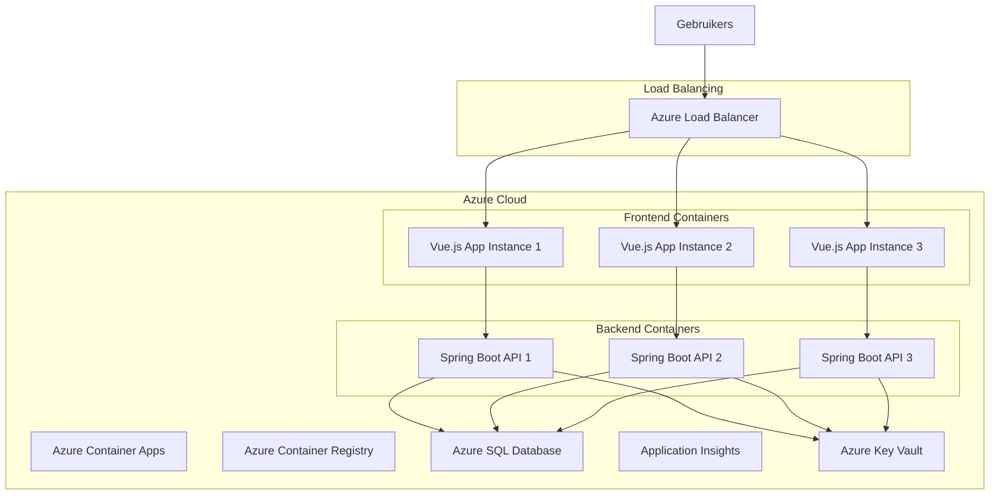
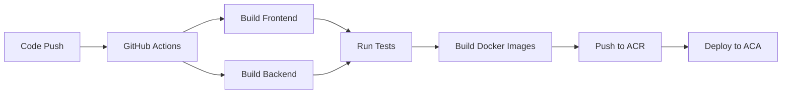

# Technische Documentatie Promptmaster

## Samenvatting van de opdracht

In het huidige technologische landschap wordt het vermogen om te programmeren steeds crucialer, maar traditionele programmeeropleidingen schieten vaak tekort in het bieden van effectieve leertrajecten. De kernproblemen zijn divers en complex: studenten krijgen onvoldoende directe feedback op hun code, er is een gebrek aan praktische oefening in realistische scenario's, en de één-op-veel benadering van klassikaal onderwijs maakt het onmogelijk om het tempo en niveau aan te passen aan individuele leerbehoeften. Dit resulteert in hoge uitvalpercentages, een groeiende kloof tussen theoretische kennis en praktische vaardigheden, en afgestudeerden die onvoldoende voorbereid zijn op de realiteit van professionele softwareontwikkeling. Daarnaast worstelen onderwijsinstellingen met de snelle evolutie van programmeertalen en frameworks, waardoor curricula vaak achterlopen op de actuele behoeften van de arbeidsmarkt.

Als antwoord op deze uitdagingen is Promptmaster ontwikkeld: een innovatief, AI-aangedreven codeerplatform dat de traditionele beperkingen van programmeeronderwijs doorbreekt. Het platform integreert geavanceerde kunstmatige intelligentie voor real-time code-analyse en persoonlijke feedback, met een gamification-systeem dat motivatie en betrokkenheid stimuleert door middel van competitieve elementen zoals versus matches en een ELO-ratingsysteem. De combinatie van adaptieve leerpaden, directe feedback, en praktijkgerichte uitdagingen zorgt voor een gepersonaliseerde leerervaring die zich automatisch aanpast aan het niveau en de voortgang van elke gebruiker. Door de implementatie van moderne cloud-technologie en een microservices-architectuur is het platform schaalbaar en toegankelijk voor een wereldwijd publiek, terwijl de integratie met industriestandaarden en best practices zorgt voor een directe aansluiting op de professionele praktijk. Deze innovatieve aanpak democratiseert hoogwaardig programmeeronderwijs en bereidt de volgende generatie ontwikkelaars effectief voor op de uitdagingen van moderne softwareontwikkeling.

### Probleemstelling
Traditionele programmeeropleidingen worden geconfronteerd met verschillende uitdagingen:
- Beperkte mogelijkheden voor directe, persoonlijke feedback
- Gebrek aan motivatie en betrokkenheid bij studenten
- Moeilijkheid in het aanpassen aan verschillende leerniveaus
- Beperkte mogelijkheden voor praktische oefening
- Weinig integratie met moderne ontwikkelpraktijken

Deze problemen leiden vaak tot:
1. Hoge uitvalpercentages in programmeeropleidingen
2. Een kloof tussen theoretische kennis en praktische vaardigheden
3. Verminderde motivatie bij studenten
4. Inefficiënt leerproces
5. Beperkte voorbereiding op professionele ontwikkelomgevingen

### Oplossing en Innovatie
Promptmaster adresseert deze uitdagingen door middel van een innovatief platform dat verschillende kernelementen combineert:

#### 1. AI-Gestuurde Code Analyse en Feedback
- **Real-time Code Evaluatie**
  - Syntaxcontrole en stijlanalyse tijdens het typen
  - Identificatie van potentiële bugs en inefficiënties
  - Suggesties voor optimalisatie en verbetering
  - Contextbewuste hints en voorbeelden

- **Persoonlijke Leerondersteuning**
  - Analyse van programmeerpatronen en gewoonten
  - Identificatie van kennishiaten en leerbehoeften
  - Adaptieve moeilijkheidsgraad op basis van prestaties
  - Gepersonaliseerde leeraanbevelingen

- **Automatische Testvalidatie**
  - Uitgebreide test suites voor elke uitdaging
  - Immediate feedback op correctheid
  - Performance analyse van oplossingen
  - Vergelijking met best practices

#### 2. Competitief en Collaboratief Leren
- **Versus Mode**
  - Real-time programmeerduels
  - Skill-based matchmaking via ELO-systeem
  - Verschillende game modes (tijdrace, accuraatheid, optimalisatie)
  - Live code-sharing en interactie

- **Community Features**
  - Globale en regionale leaderboards
  - Peer review systeem
  - Code sharing en discussieplatform
  - Team-based challenges en competities

- **Achievements en Progressie**
  - Uitgebreid badge-systeem
  - Skill-based rankings
  - Dagelijkse en wekelijkse uitdagingen
  - Persoonlijke en teamstatistieken

#### 3. Adaptief Curriculum en Leerpad
- **Gepersonaliseerde Leertrajecten**
  - Dynamische aanpassing van moeilijkheidsgraad
  - Focus op individuele leerdoelen
  - Progressieve skill ontwikkeling
  - Multitrack leerroutes (web, mobile, AI, etc.)

- **Praktijkgerichte Challenges**
  - Real-world programmeerscenario's
  - Industry-standard best practices
  - Modern tooling en workflows
  - Collaborative projecten

- **Skill Assessment en Certificering**
  - Gedetailleerde voortgangsmonitoring
  - Competentie-based evaluatie
  - Officiële certificeringen
  - Portfolio ontwikkeling

### Technologische Excellentie
Promptmaster onderscheidt zich door:

#### Geavanceerde Technische Implementatie
- State-of-the-art AI-modellen voor code-analyse
- Microservices architectuur voor optimale schaalbaarheid
- Real-time collaboratie engine
- Cloud-native infrastructuur

#### Gebruikerservaring
- Intuïtieve, moderne interface
- Responsive design voor alle devices
- Snelle, native-like performance
- Toegankelijkheid volgens WCAG 2.1 richtlijnen

#### Security en Privacy
- End-to-end encryptie
- GDPR-compliant dataverwerking
- Secure code execution environment
- Uitgebreide privacy controls

### Maatschappelijke Impact
Het platform draagt bij aan verschillende maatschappelijke doelen:

#### Democratisering van Programmeeronderwijs
- Toegankelijk voor alle skill levels
- Gratis basisfunctionaliteit
- Ondersteuning voor meerdere talen
- Focus op inclusiviteit

#### Arbeidsmarkt Ontwikkeling
- Aansluiting op industriestandaarden
- Voorbereiding op professionele ontwikkeling
- Certificering en validatie van skills
- Netwerkmogelijkheden met werkgevers

#### Innovatie in Onderwijs
- Nieuwe onderwijsmethodieken
- Data-driven learning analytics
- Integratie met bestaande onderwijssystemen
- Continue innovatie en verbetering

### Toekomstperspectief
Promptmaster is ontworpen met het oog op continue groei en ontwikkeling:

#### Korte Termijn (1-2 jaar)
- Uitbreiding van de programmeertalen bibliotheek
- Implementatie van AI-gedreven code reviews
- Introductie van team-based learning features
- Integratie met populaire IDE's

#### Middellange Termijn (2-3 jaar)
- Ontwikkeling van enterprise oplossingen
- Uitbreiding naar mobile development
- Implementatie van VR/AR leerervaringen
- Internationale lokalisatie en expansie

#### Lange Termijn (3-5 jaar)
- Ontwikkeling van een volledig AI-gedreven tutoring systeem
- Creatie van een globaal certificeringssysteem
- Integratie met formele onderwijsprogramma's
- Ontwikkeling van gespecialiseerde industriemodules

### Conclusie
Promptmaster vertegenwoordigt een significante stap voorwaarts in programmeeronderwijs door het combineren van AI-technologie, gamification en moderne onderwijsprincipes. Het platform biedt een schaalbare, effectieve oplossing voor de groeiende behoefte aan kwalitatief programmeeronderwijs en draagt bij aan de ontwikkeling van de volgende generatie softwareontwikkelaars.

## Impact op de infrastructuur

### Hardware en Systeemvereisten
- **Servers en Hosting:**
  - Geen fysieke servers vereist
  - Volledig cloud-gebaseerde infrastructuur via Azure
  - Minimale bandbreedte vereisten: 100 Mbps dedicated lijn
  - Aanbevolen: redundante internetverbinding

### Cloud Infrastructuur
- **Azure Cloud Platform** (gekozen vanwege):
  - Uitstekende schaalbaarheid
  - Geïntegreerde CI/CD mogelijkheden
  - Uitgebreide monitoring tools
  - Pay-as-you-go kostenmodel

### Deployment Diagram


### Schaalbaarheid
- **Horizontale Scaling:**
  - Automatische scaling op basis van:
    - CPU gebruik (>70%)
    - Memory gebruik (>80%)
    - Request queue length (>100)
  - Minimum instances: 3
  - Maximum instances: 20

- **Database Scaling:**
  - Azure SQL Elastic Pool
  - Automatische storage uitbreiding
  - Read replicas voor verhoogde performance

### Licenties en Software
- **Frontend:**
  - Vue.js 3 (MIT License)
  - Vite (MIT License)
  - UnoCSS (MIT License)
  - TypeScript (Apache 2.0)

- **Backend:**
  - Spring Boot (Apache 2.0)
  - Java OpenJDK 17 (GPL v2 with Classpath Exception)
  - Maven (Apache 2.0)

- **Cloud Services (Pay-per-use):**
  - Azure Container Apps
  - Azure SQL Database
  - Azure Container Registry
  - Azure Key Vault
  - Azure Application Insights

## Release plan

### Build Pipeline


### Installatie Stappenplan
1. **Azure Resources Provisioning**
   ```bash
   # Resource Group aanmaken
   az group create --name promptmaster-rg --location westeurope
   
   # Container Registry
   az acr create --name promptmasteracr --resource-group promptmaster-rg --sku Basic
   
   # Database Server
   az sql server create --name promptmaster-sql --resource-group promptmaster-rg
   
   # Key Vault
   az keyvault create --name promptmaster-kv --resource-group promptmaster-rg
   ```

2. **Database Initialisatie**
   ```bash
   # Database aanmaken
   az sql db create --name promptmaster-db --server promptmaster-sql
   
   # Schema migratie
   ./scripts/migrate-database.sh
   
   # Initiële data laden
   ./scripts/seed-database.sh
   ```

3. **Container Deployment**
   ```bash
   # Frontend deployment
   az containerapp create --name frontend \
     --resource-group promptmaster-rg \
     --image promptmasteracr.azurecr.io/frontend:latest
   
   # Backend deployment
   az containerapp create --name backend \
     --resource-group promptmaster-rg \
     --image promptmasteracr.azurecr.io/backend:latest
   ```

### CI/CD Pipeline
- **GitHub Actions Workflow:**
  1. Code validatie en linting
  2. Unit tests
  3. Integration tests
  4. Docker image building
  5. Security scanning
  6. Deployment naar staging
  7. E2E tests
  8. Production deployment

### Configuratie Management
- **Environment Variables:**
  ```yaml
  # development.env
  NODE_ENV=development
  API_URL=http://localhost:8080
  DB_CONNECTION=...
  
  # production.env
  NODE_ENV=production
  API_URL=https://api.promptmaster.com
  DB_CONNECTION=...
  ```

## Technisch design

### Software Architectuur
```